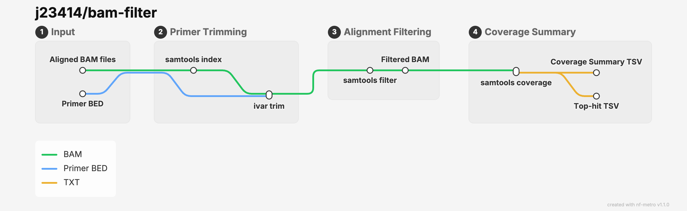

# bam-filter

A modular workflow for filtering bam alignment data and summary statistics prior to downstream analysis.

* Triming primers (iVar)
* Filtering unmapped or multi-mapped reads
* (optional) Masking duplicates



## Usage

```
nextflow run j23414/bam-filter \
  --samplesheet [path/bam_samplesheet.csv] \
  --primers [data/primers.bed] \
  --outdir "filter-results" \
  -profile stjude
```
